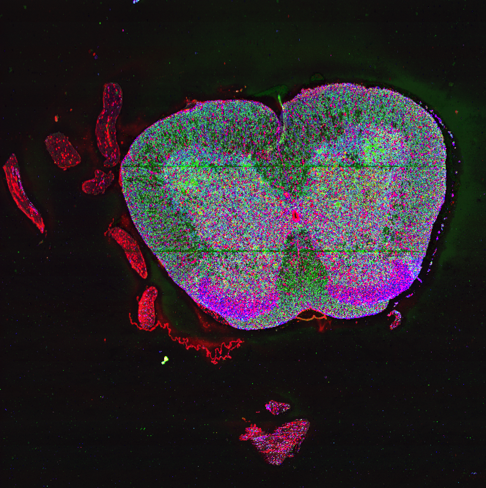

## Overview

 hudson is a computational pipeline for spatial analysis of tissue sections from multiplexed fluorescence imaging obtained from a converted Illumina
 HiSeq2500 sequencing system. It is developed by  <b> Jagjit Singh, Kunal Pandit, Rui Fu, and Sanja Vickovic. </b>

 Please follow the steps on the left for an indepth view of Hudson. This documentation also includes examples for users to test on their own systems. The
 preprint will be released soon. Below is an example of a highly multiplexed fluorescence image. 

 
  {:height="50%" width="50%"}

 Analysing such images is computationally intensive, thus the pipeline has parallel compute capability. It can be scaled over any computer cluster using
 the Slurm Workload Manager and a MPI (Message Passing Interface).

  

