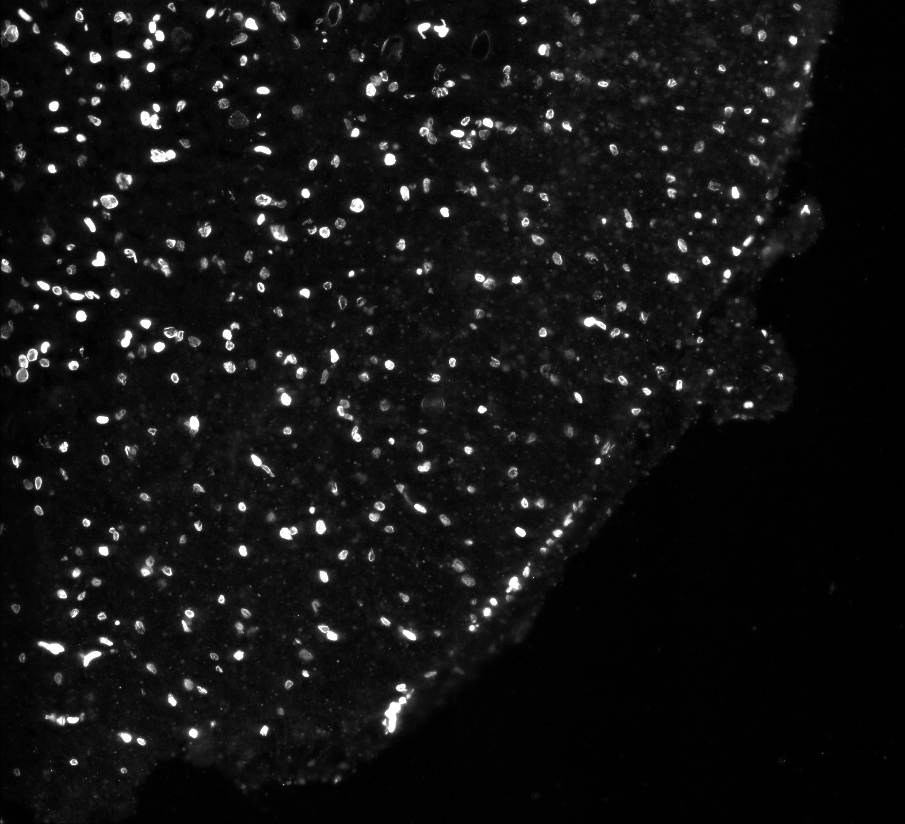
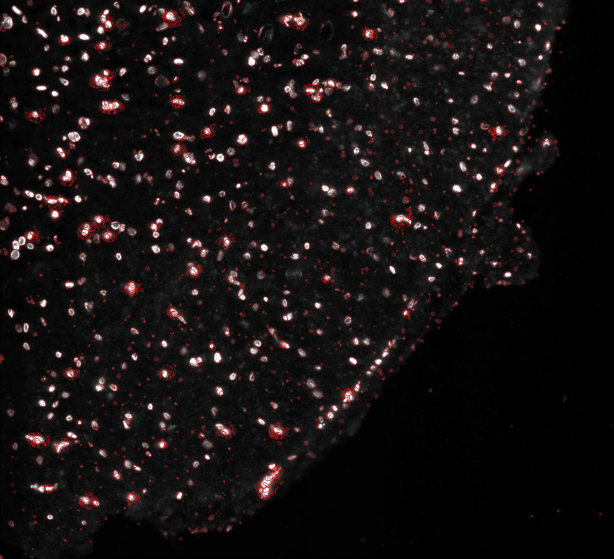

# Segementation

In the segmentation step, the pipeline performs instance segmentation on the image to generate a masks array of the same dimension as the input. The masks array is essentially the assignment of each pixel to a certain cell in the image. Hudson performs segmentation based on both cell and nucleic markers. Each cell is indexed as a label starting from 1 to the n’th cell that is segmented.Below are images of sample segmentation by this step with the original image (left) and masks outlining the different lables in the image (right). 

 

{:height="45%" width="45%"} {:height="40%" width="45%"}

The masks array is then saved for the next step of the pipeline

