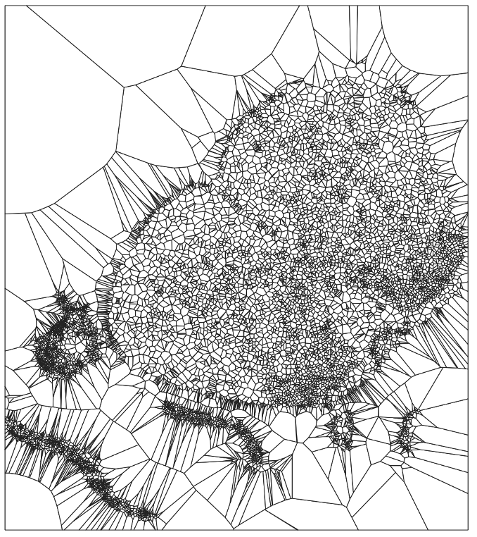

# Spatial Neighborhood

## Voronoi Diagram 

Now, that all our essential data is condensed into a single object, we extract the centroids from our anndata object, using these centroid, we create a voronoi tessalation/diagram. In simple terms a voronoi tessellation is ... . More information on Voronoi transformations can be found here. Below is a diagram of the voronoi tessalation, of create from the mouse spinal section shown on the overview page. 

 

{:height="60%" width="60%"}

As we see, the cell centroids are now vertices of the diagrams connected by their edge connections. This in turn also forms neighborhood regions, which will be used for local spatial and analysis builing micro environments in downstream analysis. 

 

## Graph Network

Now that the voronoi diagram in place, hudson uses the voronoi vertices and edges to build a network of all the cells that it has identified in the tissue section. Below is an image of the graph subset to just couple hundred nodes. Additionally, we can see that the regions are vornoi like in their shape.

 

{:height="60%" width="60%"}

## Neighborhood Cell Type Composition 

And finally, hudson then analysis the neighboring nodes which are essentially the cells for every node in the graph. Hudson is hard set to study the second order nodes, i.e neighbor's neighbor. This is done by makes an ego-groph of the a set radius. The user can go the source file change radius, and selection setting to their own use case. 

 

## Other Methodologies 

Another method to build the graph is from a KNN weights matrix. Currently, this is not a part of the hudson pipeline, however the script is provided with the repository and and the user can test and edit it. 

 
